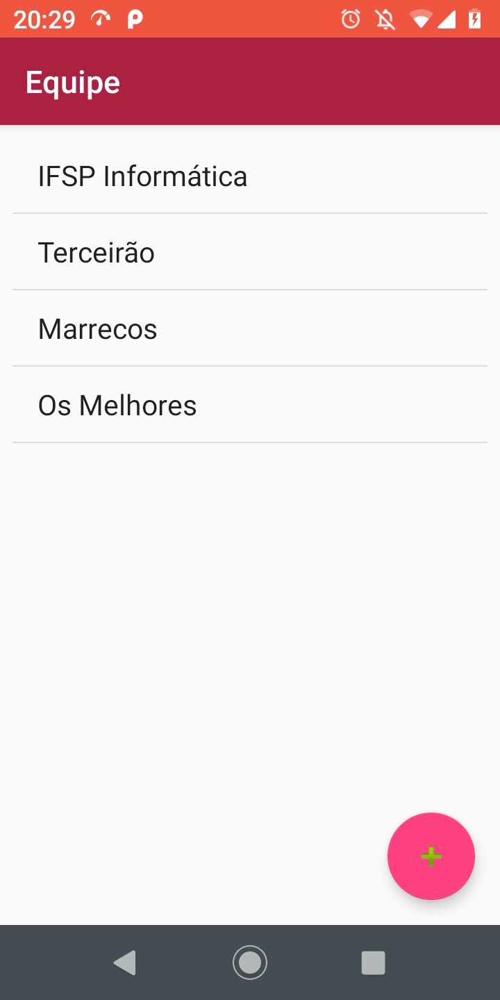
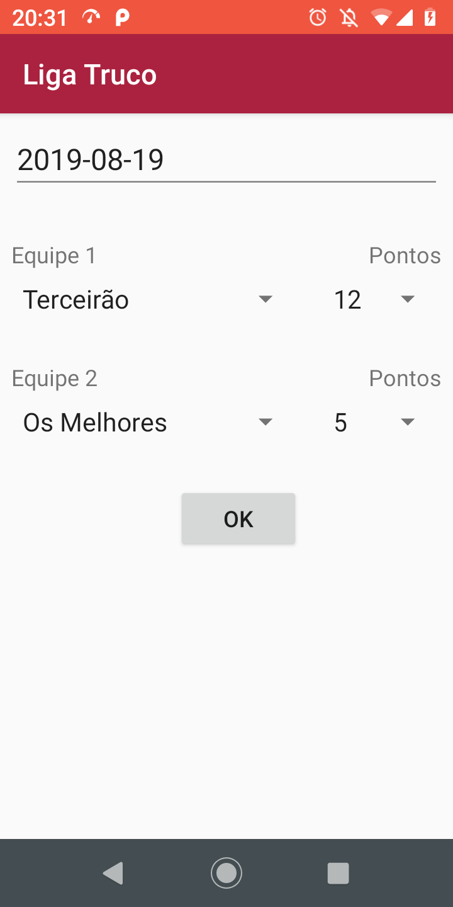

# LigaTruco

Exemplo de app com relacionamento 1xn e nxn. App android para cadastrar equipes de truco e registrar as partidas

<table>
<tr align=center>
<td></td>
<td></td>
<td></td>
<td></td>
<td></td>
</tr>
<tr align=center>
<td>Tela principal</td>
<td>Jogadores</td>
<td>Equipes</td>
<td>Integrantes</td>
<td>Partidas</td>
</tr>
</table>

<table>
<tr align=center>
<td></td>
</tr>
<tr align=center>
<td>Banco de dados</td>
</tr>
</table>

Principais queries SQL:
```
-- Listar jogadores
SELECT id,nome FROM jogador

 Inserir jogador
INSERT INTO jogador (nome) VALUES (?)

-- Listar equipes
SELECT id,nome FROM equipe

-- Inserir equipe
INSERT INTO equipe (nome) VALUES (?)

-- Exibir dados de uma equipe
SELECT id,nome FROM equipe WHERE id = ?

-- Listar integrantes de uma equipe
SELECT j.nome FROM equipe_jogador ej INNER JOIN jogador j ON j.id=ej.id_jogador WHERE ej.id_equipe = ?

-- Listar jogadores que não são integrantes de uma equipe
SELECT id,nome FROM jogador where id not in (select id_jogador from equipe_jogador WHERE id_equipe = ?)

-- Inserir integrante em uma equipe
INSERT INTO equipe_jogador (id_equipe, id_jogador) VALUES (?,?)

-- Listar partidas
SELECT
p.id
,p.data
,e1.nome as nome_equipe_1
,e2.nome as nome_equipe_2
,p.pontos_equipe_1
,p.pontos_equipe_2
FROM partida p
LEFT JOIN equipe e1 ON e1.id = p.id_equipe_1
LEFT JOIN equipe e2 ON e2.id = p.id_equipe_2
ORDER BY p.data

-- Inserir partida
INSERT INTO partida (data,id_equipe_1,pontos_equipe_1,id_equipe_2,pontos_equipe_2) VALUES (?,?,?,?,?)
```

# License

MIT License

Copyright (c) 2019 machadowma

Permission is hereby granted, free of charge, to any person obtaining a copy
of this software and associated documentation files (the "Software"), to deal
in the Software without restriction, including without limitation the rights
to use, copy, modify, merge, publish, distribute, sublicense, and/or sell
copies of the Software, and to permit persons to whom the Software is
furnished to do so, subject to the following conditions:

The above copyright notice and this permission notice shall be included in all
copies or substantial portions of the Software.

THE SOFTWARE IS PROVIDED "AS IS", WITHOUT WARRANTY OF ANY KIND, EXPRESS OR
IMPLIED, INCLUDING BUT NOT LIMITED TO THE WARRANTIES OF MERCHANTABILITY,
FITNESS FOR A PARTICULAR PURPOSE AND NONINFRINGEMENT. IN NO EVENT SHALL THE
AUTHORS OR COPYRIGHT HOLDERS BE LIABLE FOR ANY CLAIM, DAMAGES OR OTHER
LIABILITY, WHETHER IN AN ACTION OF CONTRACT, TORT OR OTHERWISE, ARISING FROM,
OUT OF OR IN CONNECTION WITH THE SOFTWARE OR THE USE OR OTHER DEALINGS IN THE
SOFTWARE.
